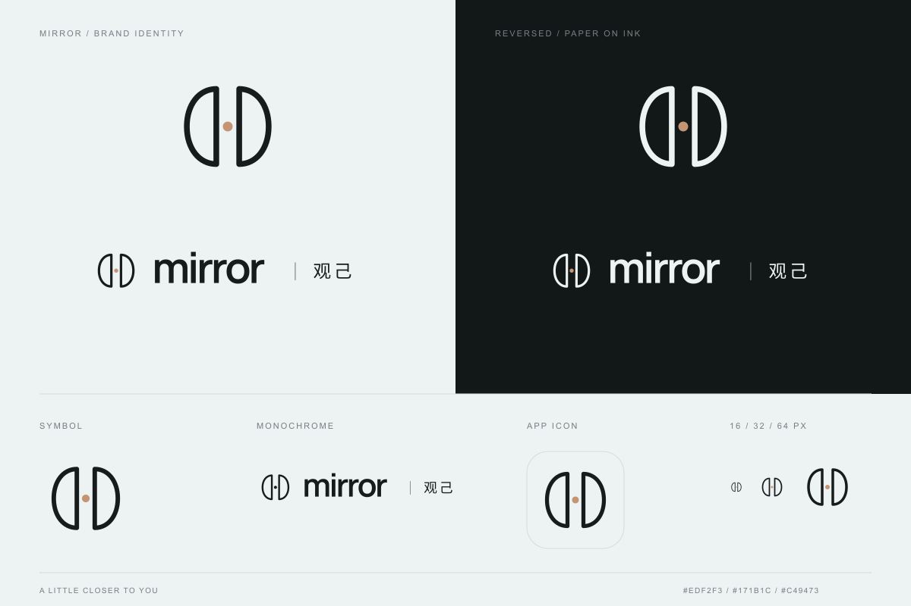

# 观己 mirror · 品牌标识

两道相向的镜面轮廓围合出向内观察的空间，中央暖色圆点代表正在被看见的自己。沿用冷灰纸、近黑墨色和克制的暖色点缀，配合原有 Manrope / 观己字标。

## 资产

所有交付资产位于 `public/assets/brand/`，SVG 背景透明，文字已转为轮廓，不依赖字体加载。

| 文件 | 用途 |
| --- | --- |
| `logo-ink.svg` / `logo-paper.svg` | 浅底 / 深底横排 Logo |
| `logo-mono.svg` / `logo-mono-paper.svg` | 深色 / 反白单色横排 Logo |
| `mark-ink.svg` / `mark-paper.svg` | 浅底 / 深底独立符号 |
| `mark-mono.svg` / `mark-mono-paper.svg` | 深色 / 反白单色独立符号 |
| `app-icon.svg` | 带冷灰底的应用图标源文件 |
| `icon-64.png`, `icon-180.png`, `icon-192.png`, `icon-512.png` | 浏览器、手机桌面与品牌信息图标 |
| `icon-maskable-512.png` | 保留系统裁切安全区的应用图标 |
| `src/app/favicon.ico` | 16 / 32 / 48 px 浏览器兼容图标 |

## 使用与维护

- 页头与分享图使用同一个 `BrandLogo`，图标使用 `BrandMark` / `BrandAppIcon`。源文件位于 `src/components/brand/`。
- 保持图形比例；独立符号最小 16 px，横排组合建议至少 168 px 宽。深底使用 paper 版本，单色场景使用 mono 版本。
- 页头外框和导航保持原尺寸；Logo 宽度在手机为 168 px、桌面为 194 px。
- 应用图标使用不透明冷灰底；符号始终位于中心安全区，圆形和圆角裁切均保留完整图形。
- 修改组件后运行 `npm run brand:build`，同步导出资产及此预览图。已有 `/icon`、`/apple-icon` 路由继续提供 PNG。
- 英文字标轮廓来自本项目 Manrope 650；中文轮廓来自项目已用于分享图的 Noto Sans SC 子集。
- 分享图中的 Logo 使用直接函数调用，向 Satori 提供原生 SVG 元素；不要改回嵌套 React 组件，否则图片可能空白。

## 验证记录

2026-09-10：类型检查、代码检查、52 项单元测试、生产构建和 42 项手机 / 桌面端到端测试通过。已核对图标、favicon、manifest 资产与三类分享图的有效内容、尺寸和响应，并更新首页视觉基准。

- 首页：[手机 393×852](./home-mobile.png)、[桌面 1363×936](./home-desktop.png)
- 分享图：[首页](./og-home.png)、[测试结果](./og-result.png)、[人格类型](./og-type.png)
