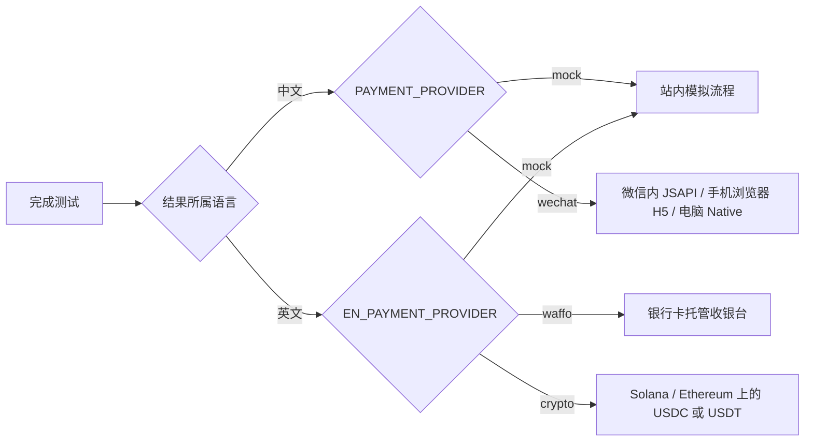
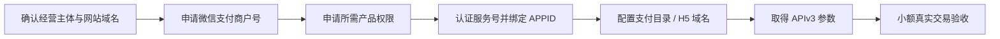
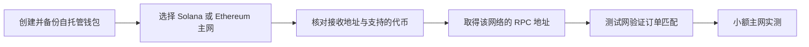
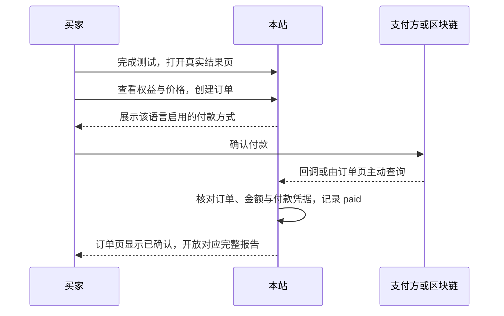
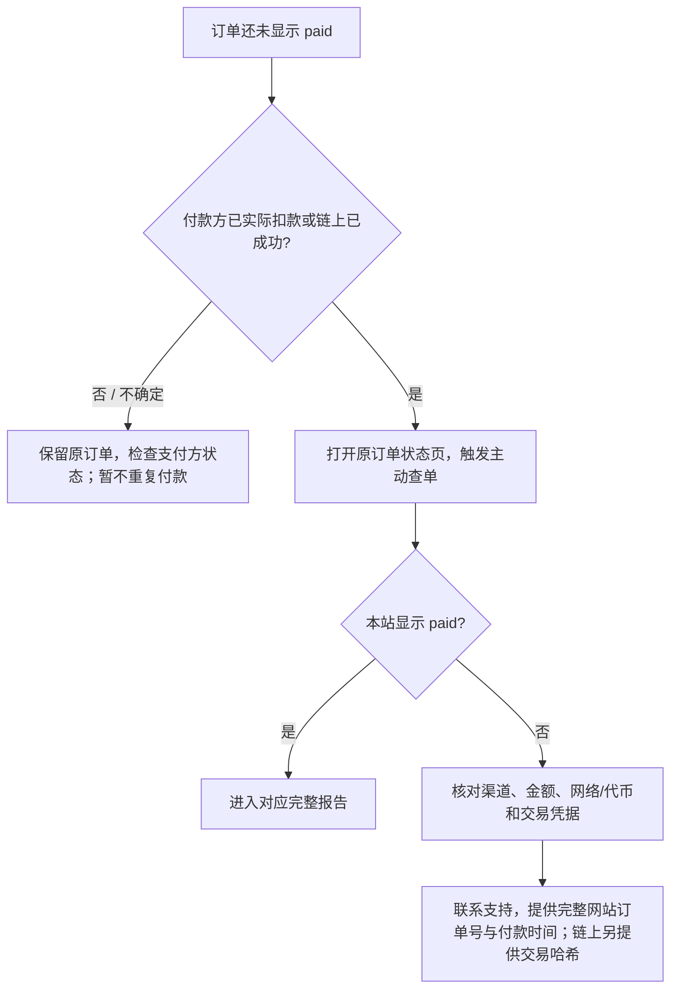

# 支付申请、使用与稳定性指南

> 核对日期：2026-09-26。本文描述当前代码的行为；第三方的资格、费率与后台入口可能变化，上线前以文中链接的官方页面和实际审核结果为准。生产支付尚需各渠道的真实交易验收。

## 先选渠道

| 渠道 | 谁处理收款 | 申请或准备 | 当前买家入口 | 上线前关键检查 |
| --- | --- | --- | --- | --- |
| 中文 `wechat` | 微信支付商户 | 申请商户号与实际需要的 JSAPI、H5、Native 权限 | 结果页付款弹层 | 主体资格、公众号绑定、支付域名、回调验签与真实查单 |
| 英文 `waffo` | Waffo Pancake 托管收银台 | 注册商户、建店和一次性商品、完成收款身份与账户资料 | 跳转收银台，再回 `/pay/[orderId]` | 测试和生产密钥分开；真实回跳、Webhook 与提现资格 |
| 英文 `crypto` | 自有收款钱包，无支付网关 | 创建自托管钱包、取得可靠的链 RPC；无需向本项目申请收款商户号 | 选择网络与币种，连接钱包或打开 Solana Pay 请求 | 收款地址、网络、代币合约或 mint、钱包兼容性、链上确认和回查 |
| `mock` | 无真实资金流 | 无 | 与真实结账相同的站内流程 | 只验证本站交互；不能代替真实渠道验收 |

每种语言同一时间只启用**一个** provider。中文订单是 CNY，英文订单是 USD；语言由完成问卷时确定，切换页面语言不会改变旧订单的渠道或价格。英文 `waffo` 与 `crypto` 目前不能在同一结账页并列。

## 申请与准备

### 微信支付（中文）

1. 从[微信支付接入指引](https://pay.wechatpay.cn/static/applyment_guide/applyment_index.shtml)申请商户号，按真实经营场景提交主体、网站、结算账户等资料。先确认主体能开通哪些产品：官方[权限表](https://pay.wechatpay.cn/doc/v3/merchant/4015616699)显示，**个体工商户和小微商户不能开 H5**；若本站需要微信外手机浏览器付款，必须先核实 H5 资格，不能只凭 JSAPI 获批就上线该场景。
2. 按浏览器场景开通[JSAPI](https://pay.wechatpay.cn/doc/v3/merchant/4012791854)、[H5](https://pay.wechatpay.cn/doc/v3/merchant/4012791841) 和 Native。JSAPI 所用公众号需要符合微信的认证与绑定要求；按[JSAPI 开发准备](https://pay.wechatpay.cn/doc/v3/merchant/4015423216)配置授权目录。H5 申请需要支付域名等资料，审核通过后再使用。
3. 从商户平台取得商户号、商户 API 证书序列号及私钥、32 字符 APIv3 密钥，并按官方方式设置微信支付公钥；如使用平台证书模式，本站可按配置自动拉取平台证书。私钥与密钥只存服务端环境变量。
4. 按下表配置后，用微信内、微信外手机浏览器和电脑扫码分别做小额真实付款。只申请了部分产品权限时，不要把未开通的场景算作已可用。

### Waffo Pancake（英文银行卡）

1. 按[官方快速开始](https://docs.waffo.ai/quickstart)注册商户并创建店铺，在店铺中创建**一次性商品**。本站每次创建托管结账会话，并按服务器计算的订单金额覆盖价格；不使用订阅商品。
2. 在 **API & Development** 创建环境对应的 API 密钥，保存商户 ID 和仅显示一次的私钥；在 Webhooks 配置 `https://你的域名/api/payments/waffo/webhook`，订阅 `order.completed`，取得相同环境的 Webhook 验签公钥。[官方集成说明](https://docs.waffo.ai/features/integrations)区分测试和生产密钥。
3. 按[身份验证](https://docs.waffo.ai/merchant/identity-kyc)填写与身份证件一致的法定姓名，再配置[收款账户](https://docs.waffo.ai/merchant/finance)。官方当前列出的人民币提现目的地为中国大陆银行卡或支付宝；是否获准收款和提现以平台审核为准。
4. 先在测试环境完成成功、拒付和 Webhook 验证；切到生产环境时更换 **API 私钥和 Webhook 公钥**，再做一笔可对账的真实付款。费率及提现费用查看[官方费用页](https://docs.waffo.ai/mor/fees)，不要依赖旧调研文档中的数字。

### USDC / USDT（英文链上支付）

这条路径**没有网关申请步骤**：本站直接读取链上转账，并把币付到配置的自有地址。经营、税务、账户及所在地适用规则需要运营方自行确认；创建钱包或 RPC 账户不等于取得任何经营许可。

| 网络 | 本站如何识别该订单 | 买家需要 | 易错点 |
| --- | --- | --- | --- |
| Solana | 每单独立的 Solana Pay `reference`，且收款地址的指定 USDC/USDT 净增不少于订单额 | 支持该请求的钱包、对应代币及 SOL 手续费 | 单纯复制地址做普通转账通常**没有 reference**，本站不能自动归单；必须按付款请求操作 |
| Ethereum | 付款钱包先签订单挑战，再从**同一地址**向收款地址发指定代币转账；到达设定确认数后识别 | 可连接的钱包、对应代币及 ETH gas | 从交易所或另一个地址直接转账、转错链/合约、余额不足，都无法匹配该订单 |

Solana Pay 是开放支付协议，`reference` 是其付款请求的一部分；参见[官方协议文档](https://docs.solanapay.com/)。Ethereum 钱包和转账需要网络手续费，参见[ethereum.org 钱包指南](https://ethereum.org/guides/how-to-use-a-wallet)。**助记词和私钥永远不要填进本站环境变量**；本站只需要公开收款地址和服务端 RPC URL。

## 配置到本站

先配置 `APP_URL`、`DATABASE_URL`、`SESSION_SECRET`，应用 `drizzle/` 迁移并确认 `/api/health` 正常。支付变量详见 [`.env.example`](../.env.example)。

| 目标 | 必要配置 | 启用方式 |
| --- | --- | --- |
| 微信 | `WECHAT_PAY_MCHID`、`WECHAT_PAY_APPID`、`WECHAT_PAY_SERIAL_NO`、`WECHAT_PAY_PRIVATE_KEY`、`WECHAT_PAY_APIV3_KEY`；JSAPI 另需 `WECHAT_MP_APPID`、`WECHAT_MP_SECRET` | `PAYMENT_PROVIDER=wechat` |
| Waffo | `WAFFO_MERCHANT_ID`、`WAFFO_PRIVATE_KEY`、`WAFFO_STORE_ID`、`WAFFO_PRODUCT_ID`、`WAFFO_WEBHOOK_PUBLIC_KEY` | `EN_PAYMENT_PROVIDER=waffo` |
| Solana | `CRYPTO_SOLANA_RECEIVER`、`SOLANA_RPC_URL`；测试网另填代币 mint | `EN_PAYMENT_PROVIDER=crypto` |
| Ethereum | `CRYPTO_EVM_RECEIVER`、`ETHEREUM_RPC_URL`；非主网另填链 ID 和代币合约 | `EN_PAYMENT_PROVIDER=crypto` |

链上模式至少配置一条完整网络（收款地址 **和** RPC），这条网络才会出现在结账页。主网代币地址写在 `src/lib/payments/crypto/config.ts`；测试网须显式覆盖代币地址或 mint。`PRICE_FEN` 与 `PRICE_USD_CENTS` 的单位分别是人民币分和美元美分。改动密钥或 provider 后重启服务；变更公开站点域名后重新构建，以同步页面里的绝对地址。

## 买家如何使用

| 买家所处场景 | 实际操作 | 返回后去哪里 |
| --- | --- | --- |
| 中文微信内 | 打开付款弹层，确认微信 JSAPI 支付 | 原页或 `/zh/pay/[orderId]` 查看状态 |
| 中文微信外手机浏览器 | 跳转微信 H5 完成支付 | 回到 `/zh/pay/[orderId]` |
| 中文电脑 | 用手机微信扫描 Native 二维码 | 留在订单页等状态更新 |
| 英文银行卡 | 在 Waffo 托管页面填卡并付款 | 回到 `/pay/[orderId]` |
| 英文 Solana | 选网络与代币，**打开或扫描当前订单的 Solana Pay 请求**，在钱包确认 | 返回订单页等待链上匹配 |
| 英文 Ethereum | 选网络与代币，连接钱包并免费签名订单挑战，再在**同一钱包**确认转账 | 返回订单页等待确认数 |

订单号是恢复这份浏览器身份的凭据，买家应私下保存，不要公开截图。换设备或钱包内置浏览器后，可从 `/help` 前往“我的报告”的找回入口，输入**完整网站订单号**。找回只恢复记录访问，不会把未付款订单标成已付。

## 稳定性与故障处理

### 当前保障及边界

| 机制 | 当前代码行为 | 运营时要注意 |
| --- | --- | --- |
| 微信通知 | 验签、解密、金额核对后更新订单；订单页可主动查单 | 支付目录、回调公网 HTTPS 和证书必须正确；查单依赖买家或运营打开订单页 |
| Waffo 通知 | 验签后按事件 ID 去重；`order.completed` 更新订单；订单页另有主动查询 | Webhook 失败日志可在 Waffo 后台查；超过订单期限的已扣款订单仍可确认 |
| 链上识别 | Solana 按 `reference` 和实际余额增量、Ethereum 按签名钱包与 Transfer 日志匹配；同一转账事件只可归一单 | 链上**没有回调**；查询由订单状态页触发，RPC 故障会延后解锁 |
| 过期 | 微信订单 15 分钟；银行卡和链上订单 30 分钟。银行卡与链上过期后 24 小时内仍尝试回查 | 24 小时窗口并非后台定时作业；页面无人访问时不会自动查单 |
| 权益 | 服务端按已付订单开放报告；重复通知和重复查单应保持幂等 | 客户端显示的 `unlocked` 不是授权依据 |

**上线限制**：当前没有独立的后台对账任务。微信回调或 Waffo Webhook 是主要异步信号；链上及回调缺失时的补偿依赖订单状态页请求。切换某语言的 provider 会暂停旧 provider 的主动查单，且对应回调路由也可能关闭。因此，生产切换前应先处理旧的待支付订单，保留旧密钥与事件记录，核实平台账单；不能只修改环境变量就认为在途订单已迁移。

### 上线验收表

| 检查 | 通过条件 |
| --- | --- |
| 申请 | 对应产品权限、主体、域名、提现身份均审核完成 |
| 环境 | 测试和生产密钥、Webhook 公钥及数据库互不混用；服务端配置不出现在客户端或 Git 中 |
| 正常付款 | 每条已启用入口各有一笔真实小额订单，支付方账单、本站订单 `paid` 与报告权限一致 |
| 延迟与重复 | 延迟回调、重复回调、重复刷新不重复授权；扣款后订单过期也能正确处理 |
| 失败 | 取消、拒付、RPC 故障、回调失败时保留测试结果，并能从原订单继续核对 |
| 恢复 | 换设备用完整订单号找回后，只能看该访客的记录和确已购买的报告 |
| 对账 | 定期比较支付平台或链上成功记录与本站 `paid` 订单；有差异时先查原订单，避免让买家再次付款 |

上线验收必须使用渠道的真实测试/生产环境：本站 `mock` 只能验证交互。开发验证命令见 [README](../README.md#本地开发)；本指南不表示上述真实渠道验收已经完成。
