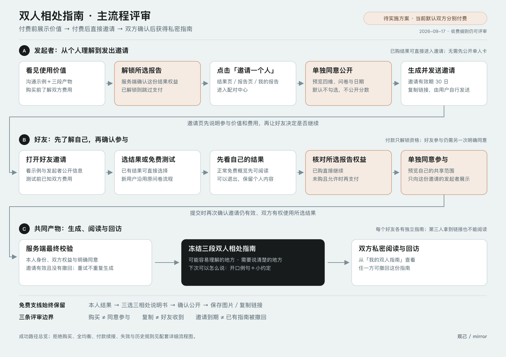
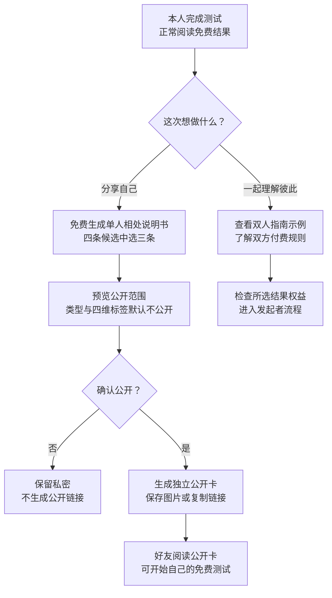
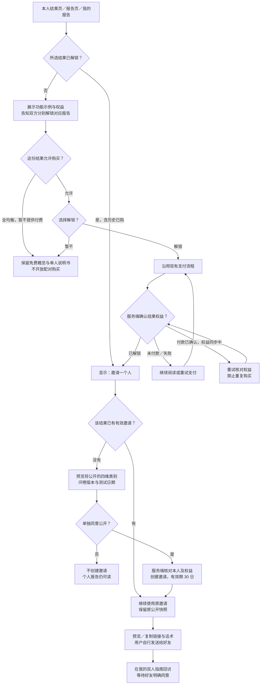
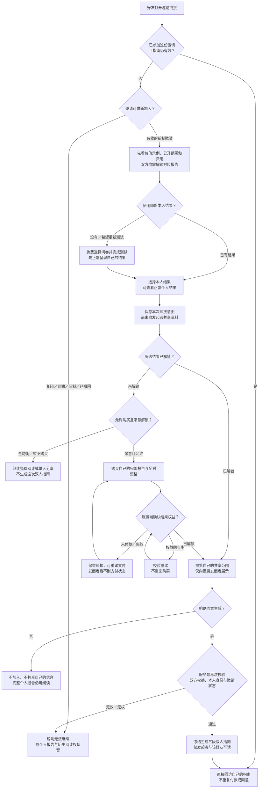
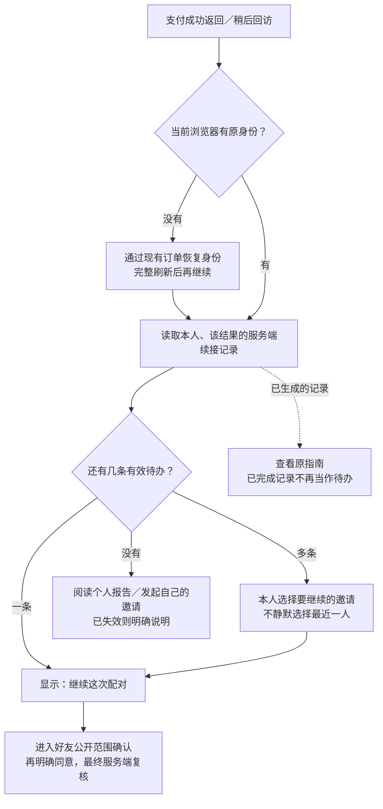
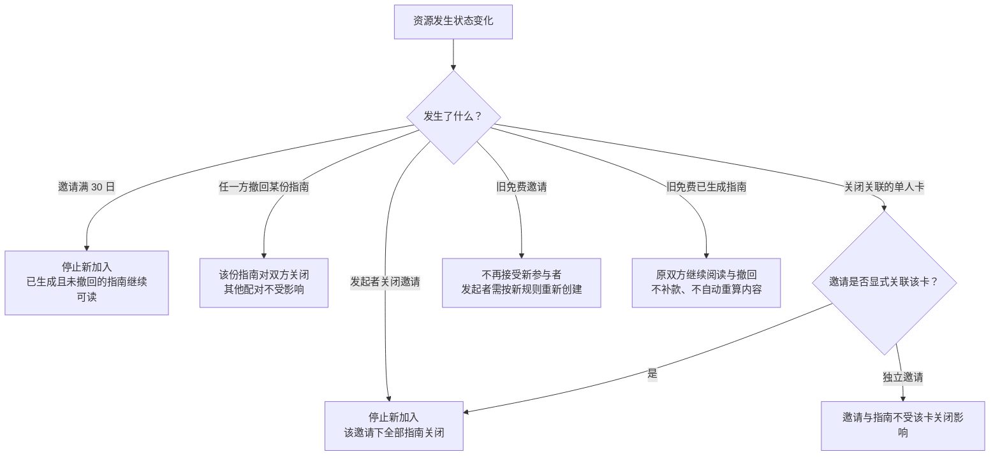

# 分享与付费双人指南：流程评审图

更新：2026-09-17  
依据：[产品与实施规格](./paid-pairing-product.md) · [实施提示词](./paid-pairing-execution-prompt.md)

**这是待实施方案，不代表线上功能已完成。** 图中按当前规格默认：**双方分别解锁各自用于配对的报告；单人相处说明书免费**。双付费是设计默认值，尚未获得用户单独确认；若改为仅发起者付费，须同步修改主规格和以下全部对应流程。

## 1. 一页总览

先看两人怎样从「看到价值」走到「拿到指南」。此图聚焦成功路径，未购买、不同意、失败及历史数据见后面的分支图。

[打开可放大的矢量图](./paid-pairing-flow/overview.svg)。图中文字和详细逻辑以本文件与主规格为准；总览图更新时须同步维护。

**评审要点：**

- 付款前能看具体沟通示例及费用规则；已购结果可以直接使用。
- 发起者从结果页、报告页或我的报告进入，无需先公开单人卡。
- 发起者先确认公开范围，好友再单独确认参与；支付不替代任何一次同意。
- 真实产物是三段私密沟通指南：可能容易理解的地方、需要说清楚的地方、下次可以怎么说。

## 2. 免费单人分享与付费配对的分流

单人卡不是配对的必经步骤；单人卡的公开同意也不授权配对。复制、下载只是用户操作，不能标成「好友已收到」或「分享成功」。

## 3. 发起者：介绍 → 解锁 → 邀请

**入口与范围：**

- 权益属于这份结果。买过其他报告不代表本次已解锁；历史已购的全均衡结果也可以使用。
- 公开邀请中只有发起者同意的定性信息，不含原结果链接、答案、分数、订单号或完整报告。
- 每份结果最多一条当前有效邀请。同一邀请可以让不同好友各自形成独立指南，不出现公开成员列表。
- 「关闭并重新邀请」必须确认会关闭旧邀请下全部指南；不能为换链接而静默关闭。

## 4. 好友：知道费用 → 自己的结果 → 再次同意

- 好友先知道费用，再决定是否测试；不能做完才第一次看到收费要求。
- 新测试必须先展示自己的正常结果，不能提交后直接配对。
- 同一邀请、同一参与者重复请求返回原指南；已撤回的指南不能通过重新提交复活。
- 付款、身份恢复、保存续接意图都不是同意参与；提交前和事务中仍须重新校验。

## 5. 支付回跳与多个邀请

**支付中邀请到期或撤回：**自己的报告权益保留，原邀请不能继续。不能自动复活邀请、换配其他人、替好友确认或让用户重复购买。已有指南的回访以未撤回为前提，邀请单纯到期不影响它。

## 6. 到期、撤回与历史内容

以上变化都不删除个人测试或已购报告。不能通过批量撤销旧邀请来实现商业升级，否则会误关闭需要保留的历史指南。

## 7. Review 时逐项核对

| 检查点 | 图中的预期 |
| --- | --- |
| 用户在何时理解价值？ | 付款前看到具体沟通示例，好友测试前也能看到 |
| 谁需要付费？ | 当前默认双方分别解锁所选报告，已购不用再买 |
| 免费分享还在吗？ | 保留独立的单人说明书支线 |
| 付款后哪里进入？ | 结果页、报告页、我的报告直接邀请，无需先公开单人卡 |
| 是否误把付款当同意？ | 发起者公开同意与好友参与同意各有独立节点 |
| 发起者能看到好友哪些信息？ | 只有好友同意后的类别与指南，看不到未同意资料或付款状态 |
| 失败后是否还有自己的报告？ | 支付买到的个人报告保留，失效邀请不自动复活 |
| 是否保留历史承诺？ | 旧已生成指南仍可读，旧邀请停止新增 |

业务规则以主规格为准；本文件用于评审流程，不新增独立接口或收费决策。详细分支使用 Mermaid 保存，便于后续随需求维护。
