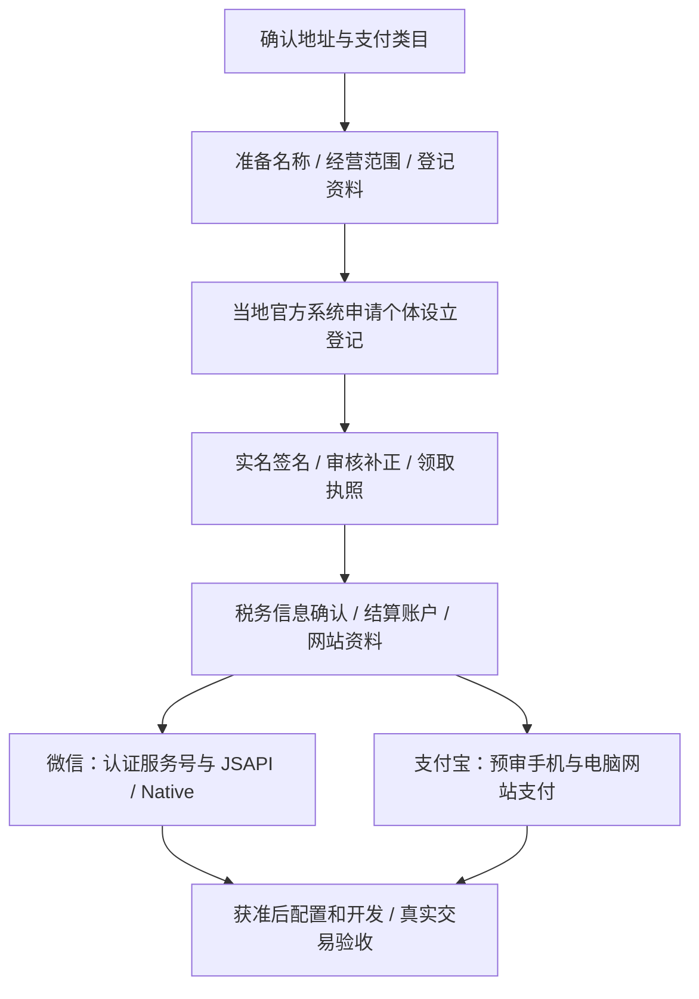

# mirror 个体工商户登记与收款申请流程

更新日期：2026 年 10 月 8 日。适用于拟以中国大陆个体工商户自营 mirror / 观己网站的经营者，涵盖营业执照登记及微信、支付宝收款申请衔接。本文给出全国通用步骤；注册城市、真实经营地址及已有执照情况尚未确定，住宅登记、材料简化和网上入口按所在地办理规则确认。本文未代为提交登记或支付申请。

## 办理顺序

**先确认真实地址，并做数字报告支付场景预审，再办理个体营业执照；领照后完成税务与账户准备，分别正式申请微信、支付宝产品。** 办照前咨询属于申请准备，不代表已获产品审批。若办照主要为了海外收款，先取得“大陆个体＋数字报告＋境外外卡远程购买”的明确答复；办照本身不保证海外收款。

## 第一步：确定登记城市与真实经营场所

向经营场所所在地的区县市场监管登记窗口咨询，或从[全国经营主体登记注册服务网](https://dj.samr.gov.cn/djfww/)和当地政府官方网站查找“个体工商户设立登记”事项。确认该地址归哪个登记机关受理，再进入当地官方系统；不假定全国使用同一个申请页面。

准备实际地址及合法使用依据，例如自有场所的产权资料，或租赁场所的合同与产权相关材料；具体组合和是否可通过数据共享免提交，以窗口清单为准。若计划用住宅，先确认当地是否允许该业务登记、是否需要住改商或其他证明，确认后再提交。

《个体工商户登记管理规定》第 9—13 条区分经营者住所与经营场所：独立站不能仅凭域名、虚拟主机租用方提供的网络空间地址办理经营场所登记；共享办公地址也不能冒充经营者的实际住所。符合条件的平台内经营者可用平台提供的网络经营场所，不能据此认定 mirror 独立站适用。[现行登记规定](https://www.samr.gov.cn/zw/zfxxgk/fdzdgknr/fgs/art/2025/art_521d2635c33c4a439f638905ed92056c.html)

可直接向登记窗口咨询：

> 我准备个人经营一个性格偏好自我探索网站，销售一次性的数字报告与双人指南，没有线下零售。拟使用的经营场所是［实际地址］。请确认该地址能否登记个体工商户、需要哪些使用证明；拟选软件开发、信息技术咨询服务、信息咨询服务等经营范围，哪些规范条目适用、是否涉及许可项目；当地应从哪个官方入口办理。

## 第二步：准备名称、组成形式与经营范围

| 登记项目 | mirror 的准备方向 |
| --- | --- |
| 主体类型 | 个体工商户，不是有限公司，也不是个人独资企业 |
| 组成形式 | 若由本人独立经营，选择个人经营；实际家庭共同经营则按家庭经营填报并补充成员资料 |
| 经营者 | 实际经营者本人，姓名和证件一致 |
| 经营者住所 | 户籍记载居所或依法适用的经常居所；与经营场所分别填写 |
| 名称候选 | 准备 2—3 个中文字号，名称方向可为“［行政区划］［字号］信息技术工作室（个体工商户）”，以当地自主申报结果为准 |
| 产品品牌 | mirror / 观己作为品牌，与营业执照全称建立明确关系；品牌名不代替执照名称 |
| 经营范围候选 | 软件开发；信息技术咨询服务；信息咨询服务（不含许可类信息咨询服务） |
| 登记联络员 | 真实联系人及常用手机号、邮箱，保持可联系 |

2025 年起施行的登记规定第 14 条要求使用名称的个体工商户在名称中标明“（个体工商户）”，不要直接套用旧模板。范围候选须在当地系统的规范目录中选取，不能只把本表文字粘贴成未经核对的范围；登记与支付类目分别审核。[登记规定第 14 条](https://www.samr.gov.cn/zw/zfxxgk/fdzdgknr/fgs/art/2025/art_521d2635c33c4a439f638905ed92056c.html)；[经营范围规范目录要求](https://www.samr.gov.cn/djzcj/zcfg/gz/art/2023/art_7e27c612a1bf4be9aa6163a8cf6a13d8.html)

说明真实业务为在线软件及自我探索信息服务，不把产品申报成线下培训、医疗诊断或心理治疗。若登记机关或支付审核要求额外许可，先确认能否满足，再决定申请；上述范围不代表所有经营许可已具备。

## 第三步：整理登记资料

| 资料 | 如何准备 |
| --- | --- |
| 登记申请书 | 使用当地系统生成的个体设立登记申请书，或窗口提供的当前表格 |
| 经营者证件 | 有效身份证件，按系统要求上传、核验；现场办理携带原件 |
| 经营场所材料 | 按第一步核准的清单准备合法使用证明，地址及房屋信息保持一致 |
| 名称与经营范围 | 名称备选、规范条目、组成形式及经营者住所 |
| 联系方式 | 联络员、手机号和邮箱 |
| 家庭经营补充材料 | 仅在实际选择家庭经营时，按当地要求提供成员及关系等资料 |
| 委托与许可材料 | 委托代办或涉及前置审批时，按要求补充授权、代理人资料或批准文件 |

全国登记细则规定设立申请的申请书、身份证明和经营场所相关文件等基础材料；实际表单及个体补充资料采用登记机关当前清单。不照搬有限公司的章程、股东、董事等材料。[设立登记与实名签名规则](https://www.samr.gov.cn/djzcj/zcfg/gz/art/2023/art_7e27c612a1bf4be9aa6163a8cf6a13d8.html)

## 第四步：网上申请、签名与领取执照

1. 登录当地官方政务服务或市场主体登记系统，由经营者完成实名注册；选择“个体工商户设立登记”，确认受理区县。
2. 按系统流程完成名称自主申报，并填报经营者、组成形式、经营范围、经营场所、住所及联络员。
3. 上传要求的场所和其他资料，核对自动生成的申请书，完成实名认证及电子签名；有委托或家庭经营时，按系统要求完成相关人员确认。
4. 提交后保存申请编号。收到补正要求时，修正地址、名称或材料并重新提交；不在未核准时将主体写成“已注册”。
5. 核准后按当地流程领取电子或纸质营业执照，核对完整名称、统一社会信用代码、经营者、经营范围和地址，发现错误及时联系登记机关。

国家细则允许网上或现场申请，并明确电子签名、实名认证及补正要求；电子营业执照与纸质执照具有同等法律效力。当地若不能全程网办，转窗口办理。本文不预设办照天数、代办费用或当地材料减免。[办理及领照依据](https://www.samr.gov.cn/djzcj/zcfg/gz/art/2023/art_7e27c612a1bf4be9aa6163a8cf6a13d8.html)

## 第五步：领照后完成税务、账户与网站准备

### 税务信息确认与申报安排

领照后及时通过所在地电子税务局或办税服务厅核对登记信息，并办理首次涉税信息确认；向主管税务机关确认适用税种、征收方式、申报期限、建账要求及发票开具方式。把确认结果记入运营记录，不根据 ¥6.90 的客单价自行认定免税或无需申报。

个体已实行营业执照与税务登记证“两证整合”，不把另外领取一张旧式税务登记证作为默认步骤；整合不免除后续税务管理。2026 年浙江税务官方指南仍列明个体首次涉税时的信息确认事项，这里仅作为流程示例，具体入口与操作按注册地办理。[两证整合国家文件](https://fgk.chinatax.gov.cn/zcfgk/c100013/c5207579/content.html)；[首次涉税信息确认示例](https://zhejiang.chinatax.gov.cn/art/2026/4/8/art_26346_652740.html)

### 结算账户与印章

微信个体方案可准备经营者本人银行卡或个体对公账户，按后台完成账户验证；支付宝网站支付的个体账户要求先确认。两家均使用真实主体资料，不共用他人的个人银行卡。[微信官方个体材料](https://pay.wechatpay.cn/static/applyment_guide/applyment_detail_website.shtml)

是否办理个体对公账户及公章，按支付审核、银行和所需授权材料确认；需要时使用当地正规办理渠道。印章、账户、公众号认证、地址租赁与代办成本分开核算，不把某一环节免费理解成整套开办零成本。

### 网站与商品资料

准备域名归属、运营主体说明、示例报告、测试后的购买页、普通报告及请 TA 交付说明、用户协议、隐私政策和真实客服信息。Native 的 PC 网站申请指引要求 ICP 备案，未备案或境外部署不能视为已经满足该项要求；备案主体不同时按要求提供网站授权材料。[Native 网站申请要求](https://pay.wechatpay.cn/doc/v3/merchant/4012791875)

## 第六步：分别申请微信与支付宝

| 通道 | 领照后顺序 | 需要取得的结果 |
| --- | --- | --- |
| 微信 | 同主体服务号注册及认证 → 普通商户与 JSAPI / Native 申请 → 确认 APPID 绑定及网站资料 → 配置与真实验收 | 数字服务类目、商户号、权限、结算账户、费用及限额核准；个体不申请 H5 |
| 支付宝 | 经营者实名认证与个体认证路径确认 → 数字报告、账户及网站资料预审 → 手机网站支付/电脑网站支付正式申请 → 获准后接入 | 准确产品合同、类目、结算及域名要求；海外外卡与 USD 能力单独确认 |

执行细节见[微信支付个体接入手册](wechat-pay-integration.md)及[支付宝个体方案](plans/mirror-alipay-sole-proprietor-plan-2026-10-08.md)。执照登记、公众号认证、支付产品开通是不同审核，前一项完成不等于后一项自动可用。代码层面的微信外手机入口与支付验签等门槛仍需完成，不能领照后直接切换生产收款。

## 第七步：持续维护

- 保存执照、登记申请回执、税务确认结果、账户验证记录及支付平台核准信息；敏感证件、银行卡号和密钥放入受控资料库，不提交到代码仓库。
- 按主管税务机关确认的期限申报，记录订单、退款、渠道手续费和结算流水；年报与税务申报分别管理。
- 每年 **1 月 1 日至 6 月 30 日**报送上一年度个体年报，当年新登记自下一年开始。例如 2026 年新登记，首次应在 2027 年上述期间报送 2026 年年报；年报内容包含网站名称及网址等信息。按当地支持方式通过[国家企业信用信息公示系统](https://www.gsxt.gov.cn/)或登记机关报送。[现行年度报告办法](https://www.samr.gov.cn/zw/zfxxgk/fdzdgknr/fgs/art/2025/art_0c753e108142465db664db16bc0e8b95.html)
- 地址、经营者、范围或联系方式发生变化时，核实登记变更及税务、支付平台同步要求；停止经营时按当前规定办理清税和注销事项。

## 办理记录表

| 项目 | 当前记录 |
| --- | --- |
| 注册城市、区县及官方办理入口 | 待确定 |
| 经营场所及合法使用证明、住宅能否登记 | 待确认 |
| 个人或家庭经营、实际经营者 | 待确认 |
| 核准名称、经营范围与统一社会信用代码 | 待办理 |
| 税务信息确认、申报周期、发票和建账要求 | 待办理 |
| 微信/支付宝各自的结算账户要求 | 待确认 |
| 域名与备案、主体一致或授权材料 | 待核验 |
| 同主体服务号、微信 JSAPI / Native 权限 | 待办理 |
| 支付宝网站产品、海外外卡专项答复 | 待确认 |
| 真实交易及报告交付验收 | 待完成 |

相关总览：[支付申请、使用与稳定性指南](payment-operations.md)。
